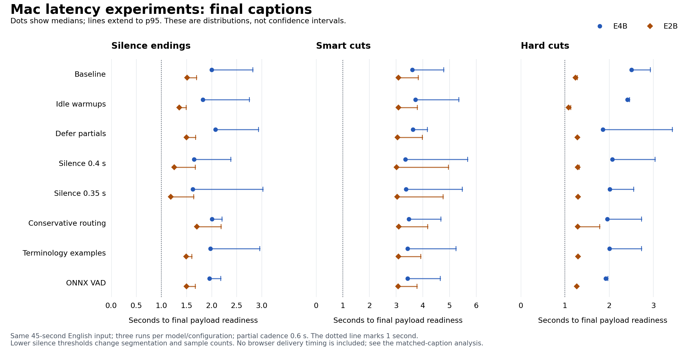

# Mac latency screening: 48 completed runs

Keep the current defaults and leave these experiments opt-in. The complete
screen does **not justify an additional combined configuration**: improvements
are model-specific, several tails or first-partial delays worsen, and shorter
silence thresholds change the captions and route mix. E4B remains the default,
with 0.5-second silence and 0.6-second partial cadence.

All 48 runs completed with exit code zero: eight configurations, E4B and E2B,
and three alternating model pairs per configuration. They produced **348 final
captions and 3,184 partials** from the same 45-second English sermon clip at real
time. This bounded screen does not replace the longer historical replays,
natural Spanish validation, or human meaning and terminology review.



Dots mark medians; line ends mark p95, not confidence intervals. Silence,
smart-cut and hard-cut distributions stay separate. The lower-silence rows
contain different captions and sample counts, so the matched analysis below
is required to interpret them.

## What the experiments showed

| Experiment | Observed result | Decision |
|---|---|---|
| Idle-only warmups | E2B all-final p50 falls 1,670 → 1,495 ms; E4B p95 rises 4,060 → 5,229 ms. Warmups actually executed 6 times per model, versus 12 at baseline. | Model-specific tradeoff; keep opt-in. |
| Final-aware partials | Suppressed 30 E4B and 17 E2B partial admissions during final decoding. First-partial p50 rises 1,386 → 1,986 ms on E4B and 782 → 1,352 ms on E2B. E4B update-gap p95 rises 1,253 → 1,802 ms. | The measured loss in partial responsiveness does not justify combining it. |
| Silence 0.4 / 0.35 seconds | Each run adds a short “Yeah.” → “Sí.” Marian final and changes the first smart-cut transcript. Matched later-caption results are much smaller and inconsistent; see below. | Do not credit the lower raw median as an equivalent-caption gain. |
| Conservative Marian | Zero Marian finals on this clip, the same route decisions as baseline. E4B all-final p50 still shifts 2,752 → 2,210 ms. | The intended routing branch is unexercised here; separate operational phrases are required. The timing swing also illustrates measurement variation. |
| Terminology examples | E4B all-final p50 is nearly unchanged, while p95 rises 4,060 → 4,704 ms. Separate text tests improve automatic canaries, with human review pending. | Treat as a quality experiment, not a demonstrated latency improvement. |
| ONNX VAD | E4B all-final p50 falls 2,752 → 2,156 ms, but p95 is slightly higher at 4,143 ms; E2B is effectively unchanged at 1,670 → 1,664 ms. | Promising E4B observation, insufficient to justify a combination given the unexercised control's similar median swing. |

The all-final figures in this table describe each complete run mix. They are
not a pooled silence/forced-cut acceptance gate. The [full comparison](comparison.md)
and [JSON](comparison.json) retain separate model, configuration, endpoint and
runtime cohorts. The [supplementary analysis](screen-analysis.md) includes every
endpoint, first-partial delay, update gap, capture-to-partial readiness and
execution counter. Its [JSON](screen-analysis.json) retains per-run component
timings, memory, model provenance and raw-file hashes.

## Matching later captions across silence settings

Changing 0.5 seconds to 0.4 or 0.35 seconds increases final count from seven to
eight per run and silence-final count from two to three. The extra fast Marian
caption makes an unadjusted silence median especially misleading. The next
smart cut also gains the prefix “these two criminals,” so it is not an identical
transcription input.

The matched comparison requires the same model and repeat, endpoint reason,
estimated speech-end sample, and English text after lowercasing and whitespace
normalization. Audio sample intervals must have intersection-over-union of at
least 0.90, and the match must be unique. This retains **18 later finals per
model/configuration**, including the same six silence finals, and excludes the
two changed captions in each variant run.

| Same six later silence finals | E4B p50 / p95 | E2B p50 / p95 |
|---|---:|---:|
| Baseline 0.5 seconds | 2,003 / 2,823 ms | 1,516 / 1,702 ms |
| 0.4 seconds | 2,141 / 2,385 ms | 1,468 / 1,674 ms |
| 0.35 seconds | 2,161 / 3,025 ms | 1,441 / 1,644 ms |

The matched E2B median reductions are about 48 and 75 ms. E4B's matched silence
median increases. Paired observation deltas, all endpoint distributions and
excluded-caption details remain in the supplementary analysis. The 0.35-second
E4B runs also contain two finalized utterances without a partial; this missing
coverage is counted rather than omitted from the interpretation.

## Timing and provenance

All observations use schema 2 and `replay_realtime`. Final latency is estimated
last VAD-positive audio-frame end to final payload readiness. It excludes browser
delivery. **No browser clients were observed; visible final acknowledgment
coverage is 0/348.** The sub-second caption-delivery goal is not established.
Smart cuts and hard cuts remain separate from silence endings; there were no
EOF-classified final rows in this input.

Percentiles are recomputed from raw observations: p50 uses the median, and p95
uses nearest rank `ceil(0.95*n)-1`. With small endpoint samples, p95 often equals
the maximum. Some original run JSONs were written by an already-running harness
that retained the older percentile method. Those original files are preserved
unchanged; use `comparison.json` and `screen-analysis.json` for the corrected
distributions. Percentiles are never averaged across runs.

Every run has the same recorded core source hashes and package versions, with
startup pipeline SHA-256
`2733b7a8cf2e0e2e25d33b957b7df445d3c9be0bcdd48021b91efccdbd168d54`.
The startup hash is an observed source file, not a claim to have hashed imported
bytecode. Configuration groups ran sequentially with model order alternating
inside each group; this was not a randomized trial with an interleaved baseline.
Source equality does not remove temporal or system variance.

Model lifecycle records identify the resolved E4B/E2B and Parakeet revisions,
Marian CT2 weight SHA-256, and process peak RSS/Metal memory. The
[runtime snapshot](../mac_v2026_14_runtime.json) records additional environment
details. The [VAD cache proof](raw/provenance/vad-cache-proof.json), observed
during collection, shows that the cached Torch Hub JIT/ONNX weights and relevant
loader files are byte-identical to installed Silero VAD 6.2.1. The Hub checkout
has no known Git revision. A later switch to the packaged loader is a separate
offline-installation reliability change, not a change retroactively applied to
these measurements.

## Retained evidence and reproduction

The [raw index](raw_index.json) lists SHA-256 and byte size for 193 unchanged
files: 48 original run JSONs, 48 final CSVs, 48 partial JSONLs, 48 diagnostic
JSONLs and the VAD proof. Audio remains local and is identified by hash in the
[frozen screening manifest](../mac_v2026_14_screening.json). The
[experiment specification](../mac_v2026_14_experiments.json) records all flags.

With the original metric paths present, regenerate the canonical report without
running inference:

```bash
python tools/mac_evaluation.py report \
  --manifest docs/evaluation/mac_v2026_14_screening.json \
  --input metrics/mac_roadmap/experiments \
  --output docs/evaluation/mac_v2026_14_screening
```

The raw index maps archived observations to their original paths for independent
recalculation. The [matched analysis rules](screen-analysis.json) make selection
and percentile definitions explicit. No human approvals, WER references, browser
ACKs or successful routing decisions were inferred from their absence.
