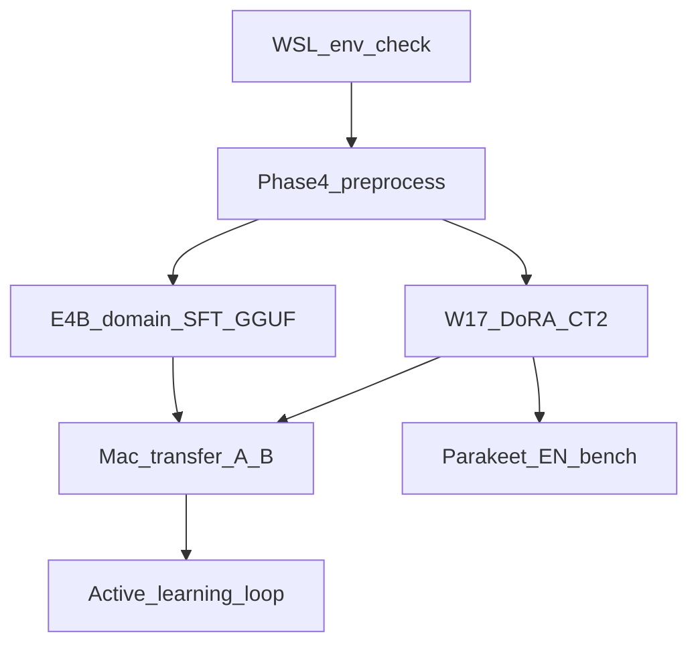

# WSL Pipeline Refresh Runbook

> **Audience:** Willem on the Windows/WSL training desktop (A2000 Ada 16GB)
> **Purpose:** Ordered execution checklist for the 2026-08 pipeline refresh — run this when the WSL box is ready, without re-deriving context from chat.
> **Related:** [`CLAUDE-windows.md`](../CLAUDE-windows.md) (env setup) · [`CLAUDE.md`](../CLAUDE.md) (project Next Steps) · [`docs/roadmap.md`](./roadmap.md) (living roadmap) · [`mac_pipeline_refresh.md`](./mac_pipeline_refresh.md) (Mac / MLX same-day path, no WSL) · [`cuda_latency_proposal.md`](./cuda_latency_proposal.md) (inference latency, §7 below)
>
> **Last updated:** 2026-09-09

---

## Already landed in code (PR / branch)

Live software for this refresh is on branch `cursor/pipeline-refresh-e609` (PR #162):

| Area | What shipped |
|------|----------------|
| Garbage filter | `no_speech_prob` / CR hard-drop, ES phantoms, unique-token ratio, partial confidence ([`dry_run_ab.py`](../dry_run_ab.py)) |
| Phase 4 runner | [`training/run_phase4_preprocess.sh`](../training/run_phase4_preprocess.sh), [`training/run_phase4_corpus.py`](../training/run_phase4_corpus.py) |
| Gemma 4 E4B SFT | [`training/run_gemma4_e4b_domain_sft.sh`](../training/run_gemma4_e4b_domain_sft.sh), [`export_gguf.py --sanity-test`](../training/export_gguf.py), 8 canaries ([`training/theological_canaries.py`](../training/theological_canaries.py)) |
| W17 Whisper | `--use-dora` in [`train_whisper.py`](../training/train_whisper.py), [`training/run_w17_curriculum.sh`](../training/run_w17_curriculum.sh) |
| Parakeet (opt-in) | [`engines/parakeet_engine.py`](../engines/parakeet_engine.py), `--stt-backend parakeet`, [`tools/benchmark_parakeet_en.py`](../tools/benchmark_parakeet_en.py) |
| Phase 7–8 tools | [`merge_corrections.py`](../tools/merge_corrections.py), [`deploy_adapters.py`](../tools/deploy_adapters.py), [`mine_hallucination_phrases.py`](../tools/mine_hallucination_phrases.py), 8-sentence [`health_check.py`](../tools/health_check.py) |

This runbook is the **WSL execution** path. Do not re-implement those scripts — run them.

---

## Flow overview



Gemma SFT and W17 can run sequentially after Phase 4 (same GPU). Prefer finishing Phase 4 before either train job so both share cleaned audio.

---

## 0. Prereqs / env check

Follow full setup in [`CLAUDE-windows.md`](../CLAUDE-windows.md) (`~/stt_train_env`, CUDA toolkit, `requirements-windows.txt`).

```bash
source ~/stt_train_env/bin/activate
cd ~/path/to/stark-translate   # or your clone
git checkout cursor/pipeline-refresh-e609   # or main after merge
nvidia-smi                                  # A2000 Ada, ~16 GB visible

# Data presence
ls stark_data/raw/*.wav stark_data/raw/*/*.wav 2>/dev/null | head
# Optional overrides used by scripts:
#   STARK_RAW_DIR, STARK_CLEANED_DIR
#   STARK_WHISPER_DATASET, STARK_W16_ADAPTER, STARK_DEEPGRAM_DIR
#   STARK_GEMMA4_TRAIN / STARK_GEMMA4_VERSE / STARK_GEMMA4_SERMON
```

**Gate:** `nvidia-smi` OK; venv active; sermon WAVs discoverable; W16 CT2 or LoRA path known if re-exporting STT (`adapters/whisper_turbo_ct2/active` or `adapters/whisper_turbo/active`).

---

## 1. Phase 4 — full audio preprocess

```bash
training/run_phase4_preprocess.sh
# equivalent: python training/run_phase4_corpus.py --input stark_data/raw --output stark_data/cleaned --resume
```

Writes `stark_data/cleaned/phase4_status.json` and `preprocessing_log.json`.

**Gate:** `ready_for_training: true`, `errors == 0`, `completed > 0`. Dry-run only (`--dry-run`) does **not** satisfy the gate.

---

## 2. Gemma 4 E4B domain SFT → GGUF

Needs S6-style verse/sermon JSONL (defaults: `bible_data/verse_pairs_train.jsonl`, `bible_data/sermon_pairs_train.jsonl`) or `STARK_GEMMA4_TRAIN`.

```bash
training/run_gemma4_e4b_domain_sft.sh
# trains Unsloth QLoRA → export_gguf.py --qtype Q4_K_M --sanity-test
```

Optional CPO follow-up after SFT (preference triples from live QE / Marian divergence):

```bash
python training/train_gemma4_cpo.py --init-adapter fine_tuned_gemma4_e4b_domain --triples <triples.jsonl>
# then re-export GGUF
```

**Gate:** sanity canary ≥ **7/8** (prod baseline) aiming **8/8** including *partimiento del pan*; GGUF on disk (default `models/gemma-4-e4b-it-q4km-domain.gguf`); point `llama-server` at it; register/activate via `tools/manage_adapters.py` or `tools/deploy_adapters.py`.

---

## 3. W17 Whisper (DoRA + hard-mix)

Do **not** hard-only (W15 lesson). Replay stays ~0.3; init from W16.

```bash
# Ensure STARK_W16_ADAPTER / paths match your layout
training/run_w17_curriculum.sh

python tools/benchmark_stt_engines.py
# uses tools/stt_bench_manifest.json (41 clips); compare to docs/archive/v2026.7/STT_BENCHMARK.md
```

**Gate (must beat or match W16, no latency regression):**

| Metric | W16 reference | W17 must |
|--------|---------------|----------|
| Overall WER (41-clip) | 11.00% | ≤ 11.00% |
| Tier-1 theological WER | 8.70% | ≤ 8.70% |
| Fresh-eval WER | 7.25% | ≤ 7.25% |
| STT p95 (A2000) | ~413 ms | ≤ ~413 ms |

Then activate CT2:

```bash
python tools/manage_adapters.py activate --model whisper_turbo_ct2 --version <w17_id>
# or: tools/deploy_adapters.py --models whisper_turbo_ct2 --endpoints local
```

---

## 4. Parakeet EN-only bench (optional — do not flip bilingual default)

```bash
pip install 'nemo_toolkit[asr]'   # WSL CUDA env only
python tools/benchmark_parakeet_en.py
```

**Gate to adopt for `--lang en` / `STARK_STT__BACKEND=parakeet` only:** mean WER ≤ W17/W16 **and** p95 ≤ Whisper on the same holdout. Spanish / bilingual path stays Whisper + W16/W17 CT2.

---

## 5. Mac transfer + Phase 7 evaluate

```bash
# From WSL
python tools/manage_adapters.py export --model whisper_turbo_ct2 --target user@mac:~/stark-translate/adapters/
python tools/manage_adapters.py export --model gemma_e4b_gguf --target user@mac:...   # if registered
# or dry-run deploy orchestration:
python tools/deploy_adapters.py --cycle N --models whisper_turbo_ct2 --endpoints mac-dev --dry-run
```

On Mac (see full checklist in [`mac_pipeline_refresh.md`](./mac_pipeline_refresh.md)):

```bash
python tools/health_check.py --backend mlx --n-canaries 8 --adapter <path>
python dry_run_ab.py --ab --backend mlx --adapter-dir <path>   # optional --turboquant
# Live YT caption compare: see tools/CLAUDE.md Layer 4
```

**Gate:** health 8-canary pass; live A/B acceptable latency; YT windowed WER trend not worse than pre-refresh baseline.

---

## 6. Phase 8 — active learning loop

```
live session → metrics/diagnostics_*.jsonl
  → python tools/prepare_finetune_data.py extract-review-queue ...
  → human / Label Studio corrections
  → python tools/prepare_finetune_data.py apply-corrections ...
  → python tools/mine_hallucination_phrases.py          # expand filter list
  → python tools/merge_corrections.py whisper|translation ...
  → retrain (W18 curriculum / Gemma CPO) on WSL
  → tools/deploy_adapters.py → Mac / church PC
```

**Stop condition:** relative improvement &lt; 2% for 2 consecutive cycles on the worst metric (WER or canary). Typical: 2–4 cycles.

---

## 7. Latency (after §1–§6 or standalone)

Full ranked proposal, gates, and citations: [`cuda_latency_proposal.md`](./cuda_latency_proposal.md). **Not yet executed on this box.** Do not run these scripts on the Mac.

Can run standalone (no Phase 4 / SFT / W17 required) as long as production GGUFs + W16 CT2 are on disk.

```bash
source ~/stt_train_env/bin/activate
# 1. Pin llama.cpp b10883 (Ada sm_89) — keep ~/llama.cpp-b9022 as rollback
LLAMA_CPP_REF=b10883 scripts/cuda/build_llamacpp.sh

# 2. Baseline on the new binary, old flags (must hold canary 7/8 ≈ 473 ms)
./start_server.sh --no-draft
python scripts/benchmarks/bench_translate_t1_t4.py --config t3 \
  --server-log /tmp/llama_t3.log --n-sermon 125 --out metrics/cuda_lat_t3.json

# 3. Official Google MTP assistants → GGUF f16 + Q4_0
scripts/cuda/convert_gemma4_assistant_gguf.sh

# 4. MTP n-max sweep (f16 KV; q8 KV → ~0% accept)
scripts/cuda/bench_mtp.sh          # t3 then t3-mtp n-max=2,3,4

# 5. Flash-attn retest (isolate from MTP first)
scripts/cuda/retest_flash_attn.sh

# 6. Optional STT: W16 as HF fp16, Parakeet TDT v3 EN+ES
python training/export_ct2.py --adapter adapters/whisper_turbo/active \
  --output adapters/whisper_turbo_ct2/active \
  --keep-intermediate --intermediate whisper_hf/W16_mixed_w7
python tools/benchmark_stt_engines.py --variant hf_fp16_w16 \
  --model-id whisper_hf/W16_mixed_w7
python tools/benchmark_parakeet_en.py   # also score ES clips; do not adopt on EN-only
```

**Gates (adopt only if all hold):**

| Step | Latency | Quality | VRAM |
|------|---------|---------|------|
| MTP (`--mtp`, default n-max=3) | E4B p50 **≤ 300 ms** (was 473) | canary **≥ 7/8**, draft accept **≥ 0.45** | STT+Marian+E4B+assistant **≤ 12 GB** |
| `-fa on` | p50 **≤** FA-off | canary 7/8 | ≤ baseline + 0.2 GB |
| `hf_fp16_w16` | p95 **≤ 261 ms** | WER ≤ 11.00% / tier-1 ≤ 8.70% | combined ≤ 12 GB |
| Parakeet | p95 ≤ 413 ms | WER ≤ W16 on **EN and ES** | — |

**Rollback:** `./start_server.sh --no-draft`. Docker default is `--no-draft`; MTP is `STARK_LLAMA_MTP=1`. Client plumbing (`dynamic_max_tokens`, keep-alive, `n_probs`) is specified in the proposal, not implemented in this patch.

Production launch after a pass:

```bash
./start_server.sh --mtp          # SPEC_N=3, f16 KV, -md e4b assistant
# Docker: STARK_LLAMA_MTP=1
```

---

## Out of scope for this refresh

- Cloud STT/MT APIs
- Live Gemma 4 26B-A4B co-resident with Whisper on the A2000 (VRAM)
- E2B→E4B speculative decode revival (measured loss). Official Gemma 4 **MTP** is the replacement — see §7 / [`cuda_latency_proposal.md`](./cuda_latency_proposal.md).
- Multi-channel TTS routing and live diarization on rolling buffer (Phase 10 polish)

---

## Quick command index

| Stage | Command |
|-------|---------|
| Phase 4 | `training/run_phase4_preprocess.sh` |
| E4B SFT + GGUF | `training/run_gemma4_e4b_domain_sft.sh` |
| W17 | `training/run_w17_curriculum.sh` then `tools/benchmark_stt_engines.py` |
| Parakeet bench | `tools/benchmark_parakeet_en.py` (EN+ES; v3 is multilingual) |
| CUDA latency §7 | `scripts/cuda/build_llamacpp.sh` → `convert_gemma4_assistant_gguf.sh` → `bench_mtp.sh` / `retest_flash_attn.sh` |
| Health | `tools/health_check.py --n-canaries 8` |
| Deploy | `tools/deploy_adapters.py` / `tools/manage_adapters.py` |
| Merge AL | `tools/merge_corrections.py` |
| Mine phantoms | `tools/mine_hallucination_phrases.py` |
